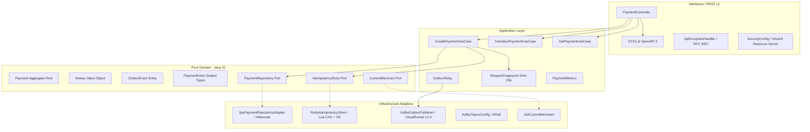

# Payments API

> Enterprise Payment Processing Platform com Arquitetura Hexagonal, Idempotência Distribuída em Duas Camadas (Redis Lua CAS + Postgres), Transactional Outbox com Apache Kafka KRaft e CloudEvents v1.0, Autenticação OAuth2 / Keycloak com Isolamento Multi-Tenant e Observabilidade Nativa OpenTelemetry.

---

## 🏗️ Arquitetura e Decisões Técnicas

Construído sob os princípios de **Clean / Hexagonal Architecture (Ports and Adapters)**, com garantia de integridade verificada estritamente via **ArchUnit** em pipeline de CI.



### Principais Destaques de Engenharia

1. **Idempotência Distribuída em Duas Camadas com Fingerprinting (ADR-0003)**:
   - **Lock & Cache Atômico em Redis**: Script Lua atômico com CAS (`tryAcquire`), TTL curto in-flight (120s) e TTL longo de conclusão (24h).
   - **Request Fingerprinting SHA-256**: Validação canônica de payload. O reuso da mesma `Idempotency-Key` com valores ou pagadores diferentes é rejeitado com **HTTP 422 Unprocessable Content**.
   - **Resiliência Fail-Open (Resilience4j)**: Se o Redis estiver indisponível ou abrir o circuito, a API delega a consistência diretamente para a restrição relacional `UNIQUE (merchant_id, idempotency_key)` no PostgreSQL.
   - **Respostas de Replay**: Replays seguros retornam **HTTP 201 Created** com o cabeçalho `Idempotent-Replayed: true`. Concorrência simultânea retorna **HTTP 409 Conflict** com `Retry-After: 1`.

2. **Transactional Outbox & CloudEvents v1.0 (ADR-0002)**:
   - Elimina o problema de dual-write entre banco relacional e Kafka gravando eventos na tabela `outbox_events` na mesma transação atômica do pagamento.
   - Poller `OutboxRelay` assíncrono com lease temporal e leitura pessimista sem bloqueio de tabela (`FOR UPDATE SKIP LOCKED`).
   - Publicação no Kafka 4.x KRaft no tópico `payments.events` compatível com a especificação **CNCF CloudEvents v1.0 (Binary Mode)** (`ce_specversion`, `ce_id`, `ce_source`, `ce_type`, `ce_subject`, `ce_merchantid`).
   - Particionamento ordenado por `payment_id`: garante que eventos de um mesmo pagamento sejam consumidos estritamente em ordem.

3. **Segurança OAuth2 & Isolamento Multi-Tenant (ADR-0004)**:
   - Validação de tokens JWT assinados pelo Keycloak com escopos granulares (`payments:write`, `payments:read`, `payments:admin`).
   - Extração automática de `merchant_id` do token JWT para particionamento lógico transparente de dados.
   - **Prevenção Ativa de BOLA (Broken Object Level Authorization - OWASP API #1)**: Consultas ou transições de recursos de outro tenant respondem com **HTTP 404 Not Found**, impedindo enumeração e vazamento de metadados.

4. **Contratos RESTful v1 e RFC 9457 ProblemDetail (ADR-0005)**:
   - Endpoints especializados estilo Stripe para a máquina de estados: `POST /v1/payments/{id}/authorize`, `/capture`, `/settle`, `/fail`, `/cancel`.
   - Concorrência otimista com **ETag** e validação de versão via cabeçalho `If-Match` (**HTTP 412 Precondition Failed** em caso de estado desatualizado).
   - Erros 4xx e 5xx padronizados em `application/problem+json` (RFC 9457).

5. **Observabilidade Nativa (OpenTelemetry + Prometheus + Grafana LGTM)**:
   - Rastreamento distribuído via OpenTelemetry bridge e push OTLP para o Grafana LGTM stack (`http://localhost:4318/v1/traces`).
   - Propagação W3C Trace Context em requisições HTTP e eventos Kafka.
   - Métricas customizadas Micrometer (`payments_created_total`, `payments_replayed_total`, `payments_outbox_pending`).

---

## 🛠️ Stack Tecnológica

| Camada | Tecnologia | Detalhes |
|---|---|---|
| **Linguagem** | Java 21 LTS | Pattern matching, records, sealed interfaces, virtual threads ready |
| **Framework** | Spring Boot 3.3.5 | Spring Security, Spring Data JPA, Spring Kafka, Spring Data Redis |
| **Build & Tooling**| Apache Maven 3.9+ | Wrapper Maven (`mvnw`), plugins Compiler, Surefire, Springdoc |
| **Banco de Dados** | PostgreSQL 16 Alpine | Migrações Flyway versionadas (`V1` a `V4`), isolamento multi-tenant |
| **Cache & Lock** | Redis 7 Alpine | Scripts Lua atômicos para CAS, TTLs e rate/idempotency locking |
| **Mensageria** | Apache Kafka 4.x (KRaft) | Sem ZooKeeper, tópico particionado `payments.events` e `payments.dlq` |
| **Segurança / IdP** | Keycloak 26 | Realm `payments` importado automaticamente com clients e scopes |
| **Resiliência** | Resilience4j 2.2 | Circuit Breakers para Kafka Publisher e Redis Idempotency |
| **Observabilidade** | OpenTelemetry + LGTM | Micrometer Tracing OTel bridge + Prometheus + Grafana |
| **Qualidade / Testes**| JUnit 5, Mockito, ArchUnit | 55+ testes unitários, fatiados e arquiteturais |

---

## 🚀 Como Executar

### Pré-requisitos
- **WSL 2 (Ubuntu/Debian) ou Linux / macOS**: Docker Engine e Docker Compose.
- **Java 21 JDK** (ou execute via container/WSL).

### 1. Iniciar Infraestrutura Local (Docker Compose)
No terminal WSL (ou Linux):
```bash
# Sobe PostgreSQL, Redis e Kafka KRaft
docker compose up -d postgres redis kafka

# (Opcional) Para subir o Keycloak e Grafana LGTM:
docker compose --profile auth --profile obs up -d
```

Verifique a saúde dos serviços:
```bash
docker compose ps
```

### 2. Compilar e Rodar os Testes
Utilize o Maven Wrapper:
```bash
./mvnw clean test
```

Para verificar regras de arquitetura hexagonal:
```bash
./mvnw test -Dtest=HexagonalArchitectureTest
```

### 3. Iniciar a Aplicação
```bash
./mvnw spring-boot:run
```
A API estará disponível em: `http://localhost:8181`
Documentação interativa Swagger UI: `http://localhost:8181/swagger-ui.html`

---

## 📡 Exemplos de Uso da API

### Obter Token OAuth2 no Keycloak (Client Credentials)
```bash
export TOKEN=$(curl -s -X POST http://localhost:8080/realms/payments/protocol/openid-connect/token \
  -d "grant_type=client_credentials" \
  -d "client_id=payments-service" \
  -d "client_secret=payments-secret" | jq -r .access_token)
```

### Criar Pagamento com Idempotência
```bash
curl -i -X POST http://localhost:8181/v1/payments \
  -H "Authorization: Bearer $TOKEN" \
  -H "Content-Type: application/json" \
  -H "Idempotency-Key: pay-req-001" \
  -d '{
    "payerId": "11111111-1111-1111-1111-111111111111",
    "payeeId": "22222222-2222-2222-2222-222222222222",
    "amount": "150.00",
    "currency": "BRL"
  }'
```
*Resposta:*
```http
HTTP/1.1 201 Created
Location: /v1/payments/3fa85f64-5717-4562-b3fc-2c963f66afa6
ETag: "W/\"0\""
Content-Type: application/json

{
  "id": "3fa85f64-5717-4562-b3fc-2c963f66afa6",
  "merchantId": "acme",
  "status": "PENDING",
  "amount": "150.00",
  "currency": "BRL",
  "payerId": "11111111-1111-1111-1111-111111111111",
  "payeeId": "22222222-2222-2222-2222-222222222222",
  "version": 0,
  "createdAt": "2026-10-05T12:00:00Z"
}
```

### Replay Idempotente (Reenvio da mesma chave)
```bash
# Executando a mesma chamada novamente:
curl -i -X POST http://localhost:8181/v1/payments \
  -H "Authorization: Bearer $TOKEN" \
  -H "Content-Type: application/json" \
  -H "Idempotency-Key: pay-req-001" \
  -d '{
    "payerId": "11111111-1111-1111-1111-111111111111",
    "payeeId": "22222222-2222-2222-2222-222222222222",
    "amount": "150.00",
    "currency": "BRL"
  }'
```
*Resposta com cabeçalho de replay:*
```http
HTTP/1.1 201 Created
Idempotent-Replayed: true
ETag: "W/\"0\""
```

### Transição de Estado com Proteção de Concorrência (If-Match)
```bash
curl -i -X POST http://localhost:8181/v1/payments/3fa85f64-5717-4562-b3fc-2c963f66afa6/authorize \
  -H "Authorization: Bearer $TOKEN" \
  -H "If-Match: \"0\""
```
*Resposta:*
```http
HTTP/1.1 200 OK
ETag: "W/\"1\""

{
  "id": "3fa85f64-5717-4562-b3fc-2c963f66afa6",
  "status": "AUTHORIZED",
  "version": 1
}
```

---

## 📑 Architecture Decision Records (ADRs)

Para detalhes aprofundados sobre as decisões tomadas, consulte o diretório [docs/adr/](docs/adr/):
- [ADR-0001: Arquitetura Hexagonal com Spring Boot 3](docs/adr/0001-hexagonal-architecture.md)
- [ADR-0002: Transactional Outbox Pattern e Especificação CloudEvents v1.0](docs/adr/0002-transactional-outbox-and-cloudevents.md)
- [ADR-0003: Idempotência Distribuída em Duas Camadas com Redis, Fingerprinting e Fail-Open](docs/adr/0003-distributed-idempotency-with-redis-and-fingerprinting.md)
- [ADR-0004: Isolamento Multi-Tenant e Autenticação OAuth2 Resource Server](docs/adr/0004-multi-tenant-isolation-and-oauth2-security.md)
- [ADR-0005: Padrões RESTful v1, Transições Stripe-Style e RFC 9457 ProblemDetail](docs/adr/0005-rest-api-standards-and-rfc9457-problem-detail.md)

---

## 🧪 Suíte de Testes e CI

O projeto possui validação contínua via GitHub Actions ([.github/workflows/ci.yml](.github/workflows/ci.yml)), executando build com PostgreSQL e Redis em container:
- **Testes Unitários de Domínio**: Agregados puros sem dependência externa em menos de 50ms.
- **Testes de Casos de Uso**: Simulação de corridas de concorrência, locks distribuídos e dead-lettering.
- **Testes de Camada Web (`@WebMvcTest`)**: Validações de contrato, escopos OAuth2, RFC 9457 ProblemDetail e BOLA.
- **Testes Arquiteturais (ArchUnit)**: Garantia estrita de que camadas de domínio e aplicação não dependem de frameworks ou infraestrutura.