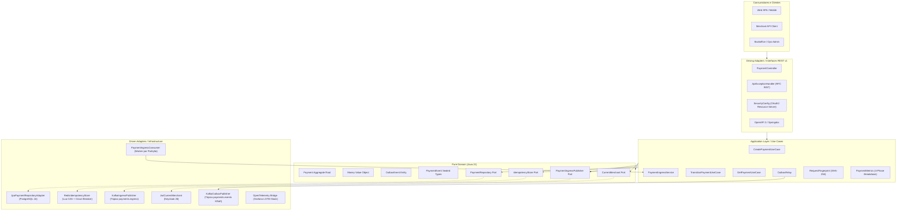
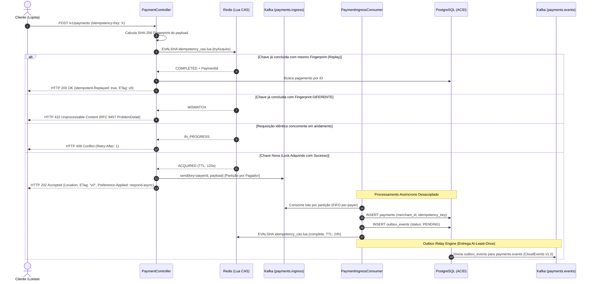
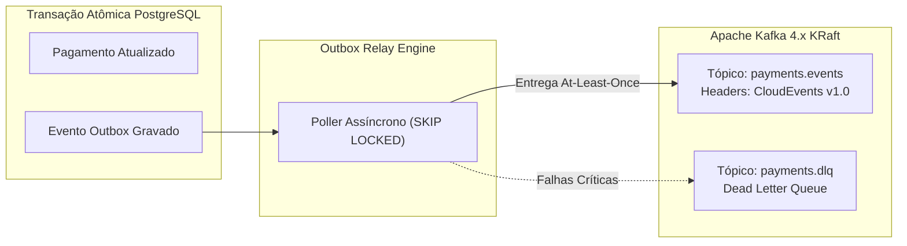
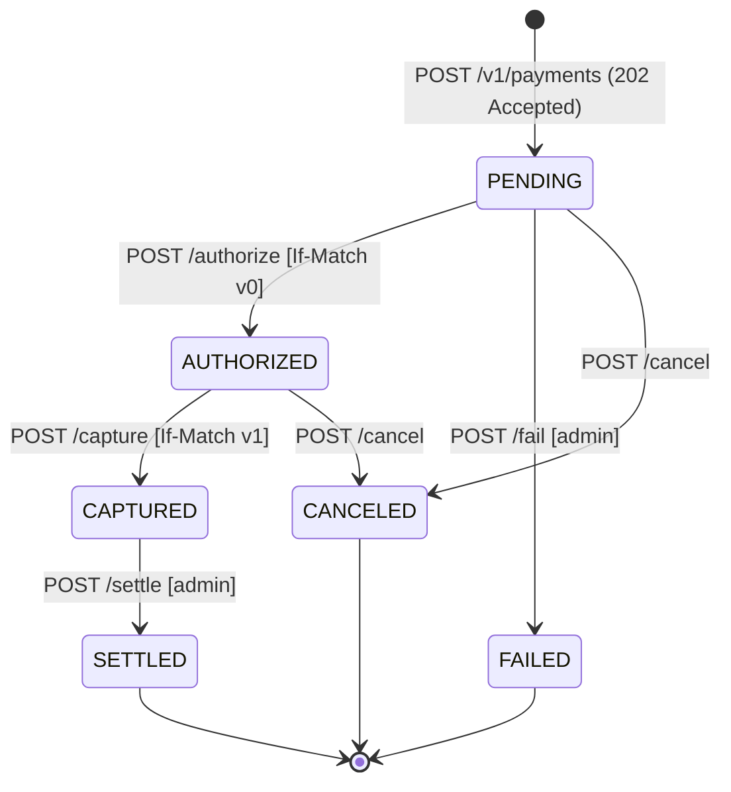

# 💳 Payments API

<p align="center">
  <strong>Enterprise Financial Processing Platform & Distributed Systems Engine</strong><br>
  <em>Clean Hexagonal Architecture • Pix-Grade Asynchronous Ingress • Dual-Layer Distributed Idempotency • Transactional Outbox • Apache Kafka KRaft • CloudEvents v1.0 • OAuth2 Multi-Tenancy • OpenTelemetry LGTM</em>
</p>

<p align="center">
  
  
  
  
  
  
  
  
  
</p>

---

## 📌 Sumário Executivo

O **Payments API** é uma plataforma distribuída de alta resiliência e baixíssima latência projetada para processamento de pagamentos em escala massiva (100.000+ requisições com throughput sustentado superior a 1.700–2.500+ req/s por nó). Inspirado na arquitetura do **Pix (Banco Central do Brasil)** e em provedores de pagamentos globais (ex.: Stripe, Adyen), o sistema elimina os problemas clássicos de sistemas distribuídos sob altíssima concorrência: **dupla cobrança**, **dual-write**, **HikariCP pool starvation**, **contenção de locks relacionais** e **vazamento de dados entre lojistas (BOLA)**.

### Destaques de Engenharia:
* **Ingestão Assíncrona na Borda (Padrão Pix / RFC 7240)**: A borda HTTP valida autenticação, sintaxe e chave de idempotência atomicamente no Redis via script Lua CAS e publica a intenção no tópico Kafka `payments.ingress`, respondendo imediatamente com **HTTP 202 Accepted** (latência de borda **p50 ~4ms**).
* **Particionamento Estrito por Pagador (`payerId`)**: As filas de ingestão são particionadas pela chave da conta do pagador, garantindo ordenação FIFO per-account, concorrência massiva paralela entre contas distintas e **zero disputa de row locks** no banco de dados.
* **Persistência ACID em Lote Assíncrono com Transactional Outbox**: Consumidores dedicados (`PaymentIngressConsumer`) persistem o agregador `Payment` e o evento correspondente em `outbox_events` em uma transação atômica única no PostgreSQL 16 Alpine (`SKIP LOCKED`), garantindo entrega *at-least-once* sem dual-write.
* **Decomposição Granular de Latência em 4 Fases**: Instrumentação completa com Micrometer `Timer` e histogramas OTel medindo:
  1. *Ingress (Borda até 202)*: ~4.1ms p50.
  2. *Queue Transit (Espera no Kafka)*: tempo em fila amortecedora.
  3. *DB Persistence (PostgreSQL ACID)*: ~2.3ms p50.
  4. *E2E Total (Req até Persistência Concluída)*: visibilidade ponta a ponta em tempo real no Grafana.
* **Idempotência Distribuída em Duas Camadas**: Redis Lua CAS com locks in-flight de 120s, cache de respostas de 24h, canonical fingerprinting SHA-256 e resiliência fail-open para restrição relacional `UNIQUE (merchant_id, idempotency_key)` com Resilience4j.
* **Padronização CloudEvents v1.0 (Modo Binário)**: Metadados CNCF nos cabeçalhos Kafka (`ce_specversion`, `ce_id`, `ce_source`, `ce_type`, `ce_subject`, `ce_merchantid`).
* **Segurança Zero-Trust & Prevenção OWASP BOLA**: Autenticação OAuth2 Resource Server via Keycloak 26, escopos granulares (`payments:write`, `payments:read`, `payments:admin`) e proteção ativa contra OWASP API #1 (BOLA) respondendo estritamente com **HTTP 404 Not Found**.
* **Contratos RESTful v1 e RFC 9457**: Transições especializadas de máquina de estados (`/authorize`, `/capture`, `/settle`, `/fail`, `/cancel`), concorrência otimista com ETags/`If-Match` (**HTTP 412**) e respostas de erro uniformes em `application/problem+json`.
* **Arquitetura Hexagonal Pura com ArchUnit**: Camadas de Domínio e Casos de Uso 100% livres de anotações ou dependências de frameworks, validadas continuamente no CI.

---

## 🏛️ Arquitetura do Sistema

### 1. Hexagonal Architecture (Ports & Adapters)

O núcleo de negócio é totalmente desacoplado da infraestrutura através de portas e adaptadores. Regras de negócio, cálculos monetários de alta precisão e transições de estado são independentes de frameworks.



---

### 2. Ingestão Assíncrona & Idempotência Distribuída (Padrão Pix)

Sob alta carga, a API não bloqueia aguardando I/O síncrono de banco de dados. Ela adquire o lock atômico no Redis, enfileira o comando no Kafka particionado por pagador e devolve `HTTP 202 Accepted` em ~4ms:



---

### 3. Decomposição da Latência em 4 Fases

Para garantir visibilidade cirúrgica da performance financeira, a API decompõe o ciclo de vida do pagamento em 4 métricas distintas:

```text
[ Cliente ] 
    │
    ▼ (1) Ingress Latency: ~4.1ms p50  ──► [ HTTP 202 Accepted ]
[ Borda API ]
    │
    ▼ (2) Queue Transit Latency: Buffer amortecedor no Kafka
[ Tópico: payments.ingress (chave = payerId) ]
    │
    ▼ (3) DB Persistence Latency: ~2.3ms p50
[ PostgreSQL ACID: payments + outbox_events ]
    │
    ▼ (4) E2E Total Latency: Duração consolidada ponta a ponta
```

| Fase | Métrica Micrometer / Prometheus | O que mede | Valor Típico (p50) |
|---|---|---|---|
| **1. Ingress** | `payments.latency.ingress` | Da chegada do HTTP até a emissão do `202 Accepted` | **~4.1 ms** |
| **2. Queue Transit** | `payments.latency.queue.transit` | Tempo em trânsito/espera na fila do Kafka | **Amortecedor dinâmico** |
| **3. DB Persistence**| `payments.latency.db.persistence` | Transação ACID relacional JDBC + Outbox | **~2.3 ms** |
| **4. E2E Total** | `payments.latency.e2e.total` | Tempo total desde o request HTTP até a gravação em disco | **Tempo real consolidado** |

---

### 4. Transactional Outbox & CloudEvents v1.0

Eliminação definitiva de dual-write. O evento de domínio é persistido na mesma transação relacional e publicado de forma assíncrona e confiável no Apache Kafka.



---

### 5. Máquina de Estados Finita do Pagamento



---

## 📡 Especificação da API REST `/v1/payments`

> [!IMPORTANT]
> **Versionamento Estrito**: Todos os endpoints de produção são estritamente versionados sob o prefixo `/v1/payments`. Rotas legadas não versionadas (`/payments`) foram descontinuadas e respondem com **HTTP 404 Not Found**.

| Método | Rota | Escopo OAuth2 | Cabeçalhos Principais | Status de Sucesso | Erros Mapeados (RFC 9457) |
|---|---|---|---|---|---|
| `POST` | `/v1/payments` | `payments:write` | `Idempotency-Key` (obrigatório) | `202 Accepted` (Novo) / `200 OK` (Replay) | `400`, `401`, `403`, `409`, `422` |
| `GET` | `/v1/payments/{id}` | `payments:read` | `Authorization: Bearer <token>` | `200 OK` (`ETag`) | `401`, `403`, `404` (BOLA) |
| `POST` | `/v1/payments/{id}/authorize` | `payments:write` | `If-Match: "v<version>"` | `200 OK` (`ETag`) | `400`, `404`, `409`, `412` |
| `POST` | `/v1/payments/{id}/capture` | `payments:write` | `If-Match: "v<version>"` | `200 OK` (`ETag`) | `400`, `404`, `409`, `412` |
| `POST` | `/v1/payments/{id}/settle` | `payments:admin` | `If-Match: "v<version>"` | `200 OK` (`ETag`) | `400`, `403`, `404`, `412` |
| `POST` | `/v1/payments/{id}/fail` | `payments:admin` | Payload: `{"reason": "..."}` | `200 OK` (`ETag`) | `400`, `403`, `404`, `409` |
| `POST` | `/v1/payments/{id}/cancel` | `payments:write` | `Authorization: Bearer <token>` | `200 OK` (`ETag`) | `400`, `404`, `409` |

---

## 🛠️ Stack Tecnológica & Engenharia

| Camada | Tecnologia | Versão | Rationale de Arquitetura |
|---|---|---|---|
| **Linguagem** | Java | 21 LTS | Records, pattern matching, sealed interfaces, virtual threads ready. |
| **Framework** | Spring Boot | 3.3.5 | Spring Security OAuth2 Resource Server, Spring Data Redis, Spring Kafka, JDBC. |
| **Build & Tooling** | Apache Maven | 3.9+ | Wrapper Maven autônomo (`mvnw`), plugins Compiler, Surefire e Springdoc. |
| **Banco de Dados** | PostgreSQL | 16 Alpine | Migrações Flyway (`V1` a `V5`), particionamento lógico multi-tenant, JDBC puro de alta vazão e `SKIP LOCKED`. |
| **Cache & Lock** | Redis | 7 Alpine | Script atômico Lua para CAS, TTLs configuráveis e rate/idempotency locking. |
| **Mensageria** | Apache Kafka | 4.x KRaft | Modo KRaft nativo (sem ZooKeeper). Tópico de ingestão `payments.ingress` e outbox `payments.events`. |
| **Segurança / IdP** | Keycloak | 26 | Realm `payments` provisionado com clients pré-configurados (`merchant-acme`, `merchant-globex`, `payments-ops`). |
| **Resiliência** | Resilience4j | 2.2 | Circuit Breakers e fallback fail-open para operações de mensageria e idempotência. |
| **Observabilidade** | OpenTelemetry | LGTM Stack | Micrometer Tracing OTel bridge + push OTLP (4318) para Grafana, Mimir, Loki e Tempo. |
| **Qualidade & Testes**| ArchUnit & JUnit 5 | 1.3 / 5.10 | 56 testes automatizados (unitários puros, isolamento hexagonal, concorrência e mocks). |

---

## 🚀 Como Executar Localmente

### Pré-requisitos
* **WSL 2 (Ubuntu/Debian) ou Linux / macOS**
* **Docker & Docker Compose**
* **Java 21 JDK** (ou use os binários do container)

### 1. Iniciar toda a Infraestrutura Local
No terminal WSL ou Linux, execute:
```bash
# Sobe PostgreSQL 16, Redis 7, Kafka KRaft 4.x, Keycloak 26, Grafana LGTM e Kafka UI
docker compose --profile tools --profile auth --profile obs up -d
```
Verifique se todos os containers estão saudáveis (`Up (healthy)`):
```bash
docker compose ps
```

### 2. Executar a Suíte de Testes Automatizados
```bash
./mvnw clean test
```
Para rodar especificamente a verificação arquitetural do ArchUnit:
```bash
./mvnw test -Dtest=HexagonalArchitectureTest
```

### 3. Iniciar a API
```bash
./mvnw spring-boot:run
```
A API iniciará na porta **8181**.

### 4. Executar Validação Automatizada Ponta a Ponta (E2E)
Disponibilizamos um script completo de automação que executa o fluxo completo em tráfego real:
```bash
bash scripts/test-e2e.sh
```
O script valida autenticação Keycloak, criação com ingestão assíncrona, replay, conflito 422, transições de estado, bloqueio BOLA 404, tabelas do Outbox e consumo de eventos no Kafka.

### 5. Executar Benchmark de Alta Performance (100.000 Requisições)
Gere carga massiva com **Java 21 Virtual Threads** e meça a performance com concorrência ajustável:
```bash
# Executa benchmark padrão (ex.: 10.000 ou 100.000 requisições)
bash scripts/benchmark.sh --total 100000 --concurrency 50
```
O benchmark gera automaticamente o relatório consolidado em [benchmark-report.md](benchmark-report.md) com Throughput (RPS), percentis de latência (p50, p95, p99) e distribuição de status HTTP.

---

## 💡 Exemplos de Uso (cURL Interativo)

### 1. Obter Token OAuth2 para o Lojista (`merchant-acme`)
```bash
export TOKEN=$(curl -s -X POST http://localhost:8080/realms/payments/protocol/openid-connect/token \
  -d "grant_type=client_credentials" \
  -d "client_id=merchant-acme" \
  -d "client_secret=acme-secret" \
  -d "scope=payments:read payments:write" | jq -r .access_token)
```

### 2. Criar Pagamento com Chave de Idempotência (Ingestão Assíncrona)
```bash
curl -i -X POST http://localhost:8181/v1/payments \
  -H "Authorization: Bearer $TOKEN" \
  -H "Content-Type: application/json" \
  -H "Idempotency-Key: pay-req-2026-001" \
  -d '{
    "payerId": "11111111-1111-1111-1111-111111111111",
    "payeeId": "22222222-2222-2222-2222-222222222222",
    "amount": "250.00",
    "currency": "BRL"
  }'
```
**Resposta (HTTP 202 Accepted):**
```http
HTTP/1.1 202 Accepted
Location: /v1/payments/7e15f60b-4899-4c80-be31-7ff40428efc7
ETag: "v0"
Preference-Applied: respond-async
Content-Type: application/json

{
  "id": "7e15f60b-4899-4c80-be31-7ff40428efc7",
  "merchantId": "acme",
  "status": "PENDING",
  "amount": 250.00,
  "currency": "BRL",
  "version": 0
}
```

### 3. Replay Idempotente Seguro
Ao reexecutar a mesma chamada acima com os mesmos dados, a resposta é instantânea do Redis sem reprocessar no banco:
```http
HTTP/1.1 200 OK
Location: /v1/payments/7e15f60b-4899-4c80-be31-7ff40428efc7
Idempotent-Replayed: true
ETag: "v0"
```

### 4. Proteção de Divergência de Payload (HTTP 422 - RFC 9457)
Reutilizar a mesma chave `pay-req-2026-001` com valor alterado (`amount: 999.00`) é imediatamente bloqueado:
```http
HTTP/1.1 422 Unprocessable Content
Content-Type: application/problem+json

{
  "type": "urn:problem-type:idempotency-key-reused",
  "title": "Idempotency Key Reused",
  "status": 422,
  "detail": "Idempotency-Key 'pay-req-2026-001' was previously used with a different request payload",
  "instance": "/v1/payments",
  "traceId": "799895b68989cc5f2b940fb9915e4570"
}
```

### 5. Transição com Concorrência Otimista (`If-Match`)
```bash
curl -i -X POST http://localhost:8181/v1/payments/7e15f60b-4899-4c80-be31-7ff40428efc7/authorize \
  -H "Authorization: Bearer $TOKEN" \
  -H "If-Match: \"v0\""
```
**Resposta:** Retorna **HTTP 200 OK**, status `AUTHORIZED` e novo cabeçalho `ETag: "v1"`.

### 6. Isolamento Multi-Tenant & Bloqueio Ativo OWASP BOLA
Ao autenticar como outro lojista (`merchant-globex`) e tentar consultar ou alterar o pagamento do `acme`:
```bash
export GLOBEX_TOKEN=$(curl -s -X POST http://localhost:8080/realms/payments/protocol/openid-connect/token \
  -d "grant_type=client_credentials" \
  -d "client_id=merchant-globex" \
  -d "client_secret=globex-secret" \
  -d "scope=payments:read" | jq -r .access_token)

curl -i -X GET http://localhost:8181/v1/payments/7e15f60b-4899-4c80-be31-7ff40428efc7 \
  -H "Authorization: Bearer $GLOBEX_TOKEN"
```
**Resposta:** **HTTP 404 Not Found** (em vez de 403), eliminando a vulnerabilidade de enumeração de dados de terceiros.

---

## 📊 Dashboards e Interfaces de Operação

| Ferramenta | URL Local | Descrição |
|---|---|---|
| **Swagger UI** | [http://localhost:8181/swagger-ui.html](http://localhost:8181/swagger-ui.html) | Documentação interativa e sandbox de testes OpenAPI 3 |
| **OpenAPI Spec** | [http://localhost:8181/v3/api-docs](http://localhost:8181/v3/api-docs) | Especificação OpenAPI 3 em formato JSON |
| **Kafka UI** | [http://localhost:8085](http://localhost:8085) | Inspeção visual de mensagens nos tópicos `payments.ingress` e `payments.events` |
| **Grafana LGTM** | [http://localhost:3000/d/payments-overview/payments-api-overview](http://localhost:3000/d/payments-overview/payments-api-overview) | Dashboard oficial com RED metrics, Outbox pending e **Latency Breakdown by Phase (p50 Mediana)** |
| **Keycloak Admin** | [http://localhost:8080](http://localhost:8080) | Painel administrativo do Identity Provider (admin / admin) |
| **Actuator Health**| [http://localhost:8181/actuator/health](http://localhost:8181/actuator/health) | Health check consolidado de persistência, mensageria e cache |
| **Prometheus Metrics**| [http://localhost:8181/actuator/prometheus](http://localhost:8181/actuator/prometheus) | Métricas expostas para scraping de telemetria |

---

## 📑 Architecture Decision Records (ADRs)

Para um entendimento aprofundado das decisões de engenharia, consulte os ADRs formalizados em [docs/adr/](docs/adr/):

* [ADR-0001: Adoção de Arquitetura Hexagonal com Spring Boot 3](docs/adr/0001-hexagonal-architecture.md)
* [ADR-0002: Transactional Outbox Pattern e Especificação CloudEvents v1.0](docs/adr/0002-transactional-outbox-and-cloudevents.md)
* [ADR-0003: Idempotência Distribuída em Duas Camadas com Redis Lua CAS e Fail-Open](docs/adr/0003-distributed-idempotency-with-redis-and-fingerprinting.md)
* [ADR-0004: Isolamento Multi-Tenant e Autenticação OAuth2 Resource Server](docs/adr/0004-multi-tenant-isolation-and-oauth2-security.md)
* [ADR-0005: Padrões RESTful v1, Transições Stripe-Style e RFC 9457 ProblemDetail](docs/adr/0005-rest-api-standards-and-rfc9457-problem-detail.md)
* [ADR-0006: Ingestão Assíncrona de Alta Vazão e Filas Particionadas por Pagador (Padrão Pix)](docs/adr/0006-asynchronous-ingress-and-partitioned-queues.md)

---

## 📂 Estrutura do Projeto

```text
payments-api/
├── .github/workflows/ci.yml       # Pipeline CI Maven com PostgreSQL e Redis
├── compose.yaml                   # Definição multi-serviço Docker Compose
├── Makefile                       # Comandos simplificados de build e infraestrutura
├── LICENSE                        # Licença MIT
├── docs/adr/                      # Architecture Decision Records formais (ADR-0001 a ADR-0006)
├── http/payments.http             # Coleção de testes para IDE (IntelliJ / VS Code)
├── infra/keycloak/                # Provisionamento e Realm exportado do Keycloak
├── scripts/
│   ├── benchmark.sh               # Benchmark de alta escala (10k a 100k requisições)
│   ├── Benchmark.java             # Motor de teste concorrente com Java 21 Virtual Threads
│   └── test-e2e.sh                # Script automatizado de validação ponta a ponta
└── src/
    ├── main/
    │   ├── java/com/portfolio/payments/
    │   │   ├── domain/            # Camada Pura de Domínio (Agregados, VOs, Eventos, Portas)
    │   │   ├── application/       # Ingestão Assíncrona, Casos de Uso, Outbox Relay e Fingerprinting
    │   │   ├── infrastructure/    # Adaptadores: PostgreSQL, Redis, Kafka (Ingress + Outbox), Security, OTel
    │   │   └── interfaces/rest/   # Controladores REST v1, RFC 9457 Exception Handler, DTOs
    │   └── resources/
    │       ├── db/migration/      # Migrações Flyway (V1 a V5)
    │       ├── redis/             # Scripts Lua atômicos para CAS
    │       └── application.yml    # Configurações com suporte a Profiles e histogramas OTel
    └── test/                      # Testes Unitários, de Integração, Concorrência e ArchUnit
```

---

## 📄 Licença

Este projeto está licenciado sob os termos da licença **MIT**. Consulte o arquivo [LICENSE](LICENSE) para obter detalhes completos.

---

<p align="center">
  Desenvolvido com foco em excelência técnica, resiliência financeira e padrões de arquitetura distribuída.
</p>